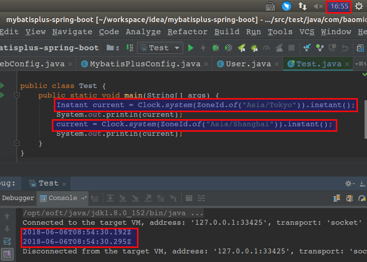

# java程序开发的标准

```
System.setProperty("user.timezone","Asia/Shanghai");
Instant——时间戳(时间戳没有时区的概念)
LocalDate——只包含当前时区的年月日，即yyyy-MM-dd。它可以用来存储生日，周年纪念日，入职日期等。
LocalTime——当前时区的时分秒，即 HH:mm:ss
LocalDateTime——它包含了日期及时间，不过还是没有偏移信息或者说时区。
ZonedDateTime——这是一个包含时区的完整的日期时间，偏移量是以UTC/格林威治时间为基准的。
```

##### Instant——时间戳(时间戳没有时区的概念), 好像这个写法是傻逼 Instant current = Clock.system(ZoneId.of("Asia/Tokyo")).instant();，看图，发现两个Instant是一样的
